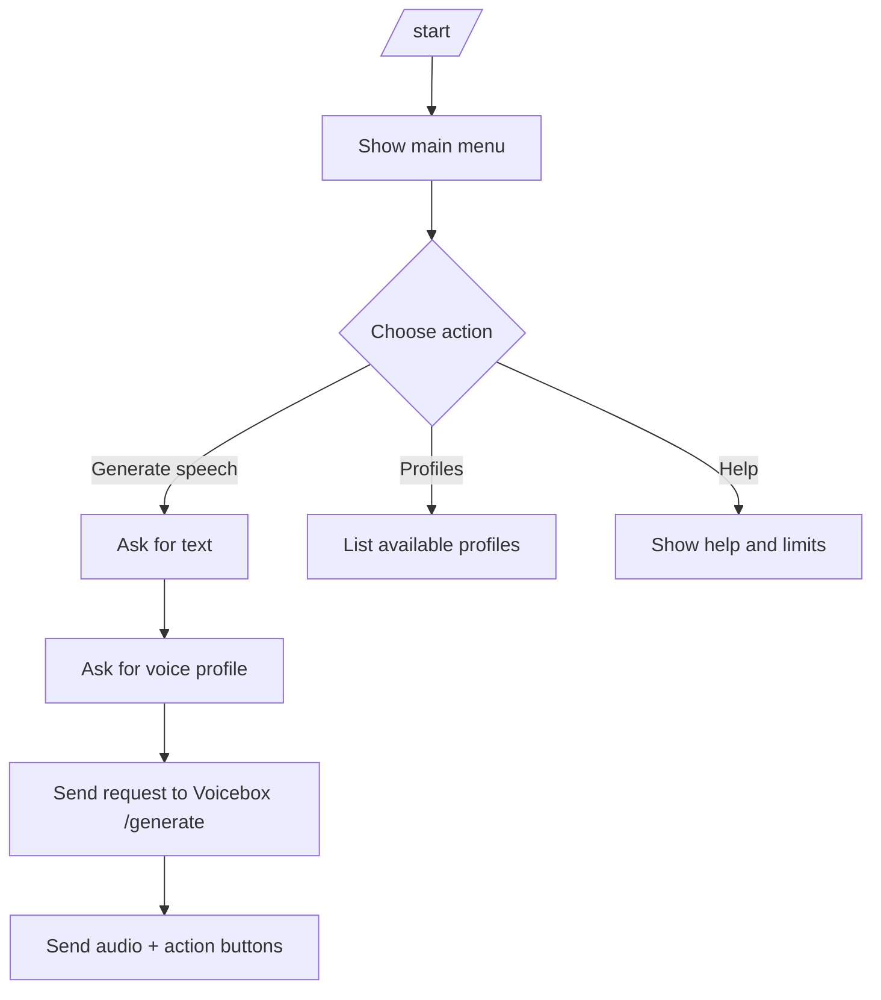

# Telegram Integration for Voicebox

This document describes how to integrate Telegram Bot API with Voicebox FastAPI through an intermediate bot service.

## 1. Architecture

```mermaid
flowchart LR
    U[Telegram User] --> TG[Telegram Bot API]
    TG --> BS[Bot Service\n(worker/web app)]
    BS --> VB[Voicebox FastAPI\n/generate, /profiles, /health]
    VB --> BS
    BS --> TG
    TG --> U
```

### Data flow

1. User sends `/start`, text prompt, or taps an inline button in Telegram.
2. Telegram Bot API sends update (polling response or webhook POST) to bot service.
3. Bot service validates state, maps command/callback, calls Voicebox FastAPI.
4. FastAPI performs generation/transcription/profile lookup.
5. Bot service returns progress/errors to user and delivers resulting audio/message.

### Responsibility boundaries

- **Telegram Bot API**: transport, rate limits, chat/session envelope.
- **Bot service**: command routing, callback handlers, retries/backoff, UX messages.
- **Voicebox FastAPI**: inference execution, model management, storage, business logic.

---

## 2. Environment variables

Below is a practical baseline for production/staging.

| Variable | Required | Example | Purpose |
|---|---|---|---|
| `TELEGRAM_BOT_TOKEN` | Yes | `123456:AA...` | Telegram bot authentication token |
| `TELEGRAM_MODE` | Yes | `polling` / `webhook` | Update delivery mode |
| `TELEGRAM_WEBHOOK_URL` | Webhook only | `https://bot.example.com/telegram/webhook` | Public HTTPS endpoint registered in Telegram |
| `TELEGRAM_WEBHOOK_SECRET` | Webhook recommended | `long-random-string` | Secret header check for webhook authenticity |
| `TELEGRAM_ALLOWED_UPDATES` | No | `message,callback_query` | Reduce update noise and parse cost |
| `VOICEBOX_API_URL` | Yes | `http://voicebox-backend:8000` | Voicebox FastAPI base URL |
| `VOICEBOX_API_TIMEOUT_SEC` | Yes | `120` | Timeout for API calls from bot service |
| `BOT_CONCURRENCY` | No | `4` | Number of parallel update workers |
| `BOT_RETRY_MAX_ATTEMPTS` | No | `3` | Retry count for transient Telegram/API errors |
| `BOT_RETRY_BACKOFF_MS` | No | `500` | Base backoff for 429/5xx and network failures |
| `LOG_LEVEL` | No | `INFO` | Logging verbosity |

> Keep `TELEGRAM_BOT_TOKEN` and webhook secrets in a secret manager (Vault, SSM, GitHub Actions secrets), never in repository files.

---

## 3. Polling vs Webhook modes

### Polling mode

**When to use**
- Local development
- Small internal deployments
- Environments without stable public HTTPS ingress

**Pros**
- Easiest setup
- No TLS termination required
- Works behind NAT for outbound-only workers

**Cons**
- Slightly higher response latency
- Less efficient at scale
- Worker downtime can delay update handling

**Operational notes**
- Run exactly one consumer per bot token unless offsets are partitioned intentionally.
- Persist update offset if the framework does not do this automatically.

### Webhook mode

**When to use**
- Production
- Low-latency interactions
- Horizontally scaled bot services

**Pros**
- Lower end-to-end latency
- Better scalability and resource efficiency
- Natural fit for load-balanced deployments

**Cons**
- Requires public HTTPS endpoint
- Requires webhook secret validation and ingress hardening

**Operational notes**
- Verify `X-Telegram-Bot-Api-Secret-Token` (or framework equivalent).
- Return 200 quickly; offload heavy generation to background worker queue.

---

## 4. Docker and systemd deployment scenarios

### 4.1 Docker Compose (backend + bot worker)

```yaml
# docker-compose.telegram.yml
version: "3.9"

services:
  voicebox-backend:
    image: ghcr.io/your-org/voicebox-backend:latest
    container_name: voicebox-backend
    environment:
      - HOST=0.0.0.0
      - PORT=8000
    ports:
      - "8000:8000"
    volumes:
      - ./data:/app/data
    restart: unless-stopped

  telegram-bot:
    image: ghcr.io/your-org/voicebox-telegram-bot:latest
    container_name: voicebox-telegram-bot
    depends_on:
      - voicebox-backend
    environment:
      - TELEGRAM_BOT_TOKEN=${TELEGRAM_BOT_TOKEN}
      - TELEGRAM_MODE=polling
      - VOICEBOX_API_URL=http://voicebox-backend:8000
      - VOICEBOX_API_TIMEOUT_SEC=120
      - BOT_CONCURRENCY=4
      - LOG_LEVEL=INFO
    restart: unless-stopped
```

Start:

```bash
docker compose -f docker-compose.telegram.yml up -d
```

### 4.2 systemd (two services on one host)

Create `voicebox-backend.service`:

```ini
[Unit]
Description=Voicebox FastAPI Backend
After=network.target

[Service]
User=voicebox
WorkingDirectory=/opt/voicebox/backend
Environment="HOST=0.0.0.0"
Environment="PORT=8000"
ExecStart=/opt/voicebox/.venv/bin/uvicorn main:app --host 0.0.0.0 --port 8000
Restart=always
RestartSec=3

[Install]
WantedBy=multi-user.target
```

Create `voicebox-telegram-bot.service`:

```ini
[Unit]
Description=Voicebox Telegram Bot Worker
After=network.target voicebox-backend.service
Requires=voicebox-backend.service

[Service]
User=voicebox
WorkingDirectory=/opt/voicebox/bot
EnvironmentFile=/etc/voicebox/telegram-bot.env
ExecStart=/opt/voicebox/.venv/bin/python -m bot.main
Restart=always
RestartSec=3

[Install]
WantedBy=multi-user.target
```

Enable and run:

```bash
sudo systemctl daemon-reload
sudo systemctl enable --now voicebox-backend.service
sudo systemctl enable --now voicebox-telegram-bot.service
```

---

## 5. SLA expectations and limitations

These are practical expectations for planning and support communication.

- **Cold start / first generation**: can be significantly slower while model weights download and initialize.
- **Warm generation latency**: depends on hardware, model size, text length, and concurrency.
- **No hard real-time guarantees**: Telegram + generation workload is best-effort; queueing delay may appear under load.
- **Throughput bounded by inference hardware**: add worker queueing and rate limits for predictable behavior.
- **Telegram API constraints**: global and per-chat rate limits apply independently of Voicebox performance.

Recommended SLO framing:
- P95 command acknowledgment: < 2s (bot response like “Generating…”) 
- P95 short-text generation completion: target per environment (define from benchmarks)
- Error budget: explicitly track 429/5xx from Telegram and 5xx/timeout from backend

---

## 6. Incident runbook

### A) Model did not download

**Symptoms**
- Generation fails with model-not-found/load error
- Backend logs show HuggingFace download/auth/network issues

**Checks**
1. Verify outbound internet access from backend host.
2. Verify disk space in model cache path.
3. Confirm required model identifiers and backend config.
4. If private model, verify HF token permissions.

**Actions**
- Retry download manually via backend model management flow.
- Clear partial/corrupted cache and re-download.
- Pin to known-good model version.
- Add startup healthcheck to assert model presence before enabling bot traffic.

### B) Generation timeout

**Symptoms**
- Bot responds with timeout/failure for long text
- Backend request duration exceeds configured timeout

**Checks**
1. Inspect queue depth and worker saturation.
2. Compare timeout settings in bot (`VOICEBOX_API_TIMEOUT_SEC`) and reverse proxies.
3. Check GPU/CPU/memory pressure and swap activity.

**Actions**
- Send immediate progress acknowledgment message to user.
- Split long text into chunks with sequential delivery.
- Increase timeout only with capacity validation.
- Apply per-chat concurrency caps and queue backpressure.

### C) Telegram 429 / 5xx

**Symptoms**
- `Too Many Requests` errors
- Temporary Telegram upstream errors

**Checks**
1. Capture `retry_after` from 429 responses.
2. Review message burst patterns (broadcast, retries, callback storms).
3. Check webhook latency and error ratio.

**Actions**
- Honor `retry_after` strictly.
- Implement exponential backoff with jitter for 5xx/network failures.
- Deduplicate retries by update id/message id.
- Degrade gracefully: notify user that delivery is delayed.

---

## 7. UX examples: flow diagrams, buttons, callback routes

### 7.1 Main conversational flow



### 7.2 Inline buttons and callback routes

| UI Button | Callback data | Bot route/handler | Effect |
|---|---|---|---|
| `🎙 Generate` | `gen:start` | `callback_generate_start` | Starts generation flow |
| `👤 Profile: Alice` | `gen:profile:alice` | `callback_select_profile` | Stores selected profile |
| `🌐 Lang: EN` | `gen:lang:en` | `callback_select_language` | Sets language context |
| `🔁 Regenerate` | `gen:retry:<request_id>` | `callback_regenerate` | Replays generation request |
| `❌ Cancel` | `gen:cancel:<request_id>` | `callback_cancel` | Cancels pending job/state |
| `ℹ️ Status` | `gen:status:<request_id>` | `callback_status` | Shows queue/progress state |

### 7.3 Text mockup of UX screens

```text
[Main Menu]
Voicebox Bot
- Generate speech from your saved voice profile.
Buttons:
[🎙 Generate] [👤 Profiles] [ℹ️ Help]

[Generation Complete]
Done! Request #a18f
Voice: Alice | Language: EN
Buttons:
[🔁 Regenerate] [ℹ️ Status] [❌ Cancel]
```
